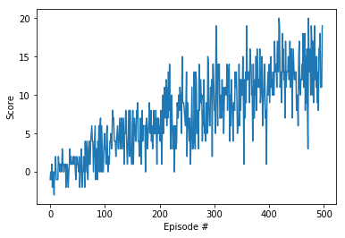

# Report  "Navigation project"

### Learning algorithm 

* dqn function (Navigation.py file)

  > ​	The first loop contains all the actions performed during a full episode (it ends when the variable « env_info.local_done » is equal to true). First we have to reset the environment so the agent can reproduce its learning with similar conditions in each episode.                                                              We then retrieve the very first state of the agent (that we just created in the cell above with the   line :`agent = Agent(state_size=state_size,action_size=4, seed=0)` ) from which the episode is going to start. Since we want to get the mean score of each batch of 100 episodes, we set the score to zero.
  >
  > ​	The second loop is about how the agent perform its learning during each transition from one time step to another throughout the episode. First the agent need to pick the appropriate action, relatively to its knowledge at that point in time (`action = agent.act(state, eps)` ).                                      By receiving back a new state along with a reward from the environment, the agent is then able to improve its behavior using our Qnetwork model ( `agent.step(state, action, reward, next_state, done `). 
  >
  > ​	Let’s see how the Agent class is implemented to have a better understanding of what is really happening when we call these two methods on the agent object.

  ​    

* "Agent" class (agent.py file)

  > ​	To create an agent, we first need to specify the state size and the action size (along with a random seed freely chosen by the user) that respectively define the number of input and output units of our neural network. If we take a look at the *Qnetwork* class described in the *model.py* file, we notice that we add two hidden layers to the network, each of them containing 64 units.  Using that class, we create two different neural network as attributes to an agent, namely *qnetwork_local* and *qnetwork_target*. The first one is used to evaluate the action values corresponding to a given state (in order for the agent to be able to choose the action that maximizes this value) .The goal of the second is to  use a « stable » network (by keeping its weights fixed for four time steps) for evaluating targets values during the learning process (performed in the learn method) instead of reusing the current network (namely *qnetwork_local*) for that, thus generating a moving target and making the loss function unreliable.
  >
  > ​	In the act method, we first use our *qnetwork_local* network to get the expected action values ( `action_values = self.qnetwork_local(state)` ) . Once we have them, we select an action by applying the "exploitation vs exploration" dilemma : either the agent selects the greedy action with probability 1-epsilon ( `return np.argmax(action_values.cpu().data.numpy()` )  or it selects an action *uniformly* at random from the set of available (non-greedy and greedy) actions with probability epsilon (  `return random.choice(np.arange(self.action_size)` )*.* The next function that we used in our algorithm is the step method. Let’s see what it does.  
  >
  > ​	After adding the current « sarsa » sequence to the memory, it randomly retrieves some of it (from the update memory) in order to learn from them. Since the agent has to perform an episodic task during which we want it to care about distant features, we set the discount factor GAMMA to a value very close to one. As we explain earlier, the learn method evaluates TD targets and current action values with two slightly different networks : first, using *qnetwork_target*, we compute a tuple containing the larger action values corresponding to the « next_states » sequence                           `(Q_targets_next  = self.qnetwork_target(next_states) ...)`….then we deduce TD targets from that (`Q_targets = rewards + (gamma \* Q_targets_next * (1 – dones)`)….then we get the current action values directly from *qnetwork_local* (`Q_expected = ... `) . The next lines compute the mean squared error between targets and current values, before applying backpropagation and updating the *qnetwork_local* neural network.

### Performance 

​	The environment is solved after 498 episodes ; at that point, my agent gets an average score of 13.01 (over the last 100 episodes).

  

### How to improve it ?

​	   The very first thing that we could do here to boost performance is using a "grid search" (consist of selecting the best possible hyperparameters combination for a model by "cross-testing" specific range of values) over the following parameters :  `esp_decay`, `BACTH_SIZE`, `TAU` and `LR` .

​	Another idea is to make improvements to some parts of the algorithm.  For example, it has been shown that at the beginning of the learning process, the DQN algorithm tends to return overestimated Q-values (due to the fact that a very few number of states have been explored). With the "Double DQN" algorithm, this issue is settled using two different sets of weights, one to select the best action (whose action values is the larger) with the `arg max` function and another one (more reliable) to "re-evaluate" that action, thus generating more stable action values. Another issue may come to mind when we realize that all the experiences of the agent are not equally relevant to its learning process. In the "Prioritized experience replay" version, the most important experiences are more likely to be selected from the memory, leading the agent to learn in a more effective way. Finally, the "dueling DQN" version allow us to significantly reduce computation complexity by combining the classic state value with a new function that eventually lead to get action values in a more direct way. Along with these three extensions of DQN, we may mention "distribu-tional DQN", "noisy DQN" and the "learning from multi-step bootstrap targets" process as well, each of them addressing another issue with the original algorithm (all of these improvements have led to the "Rainbow" algorithm). 
